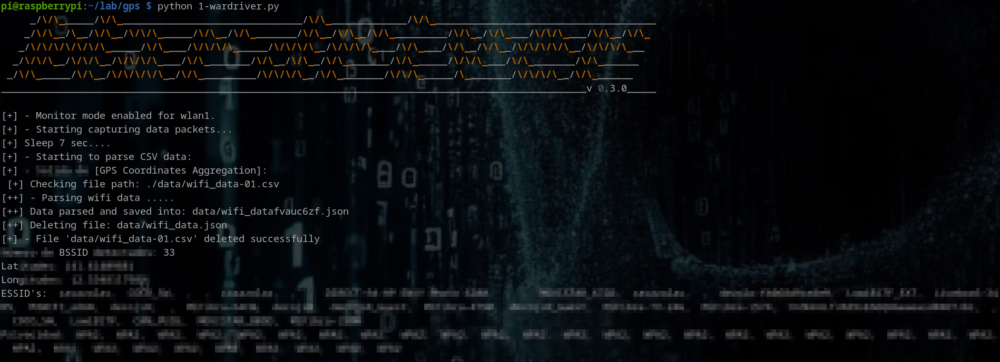
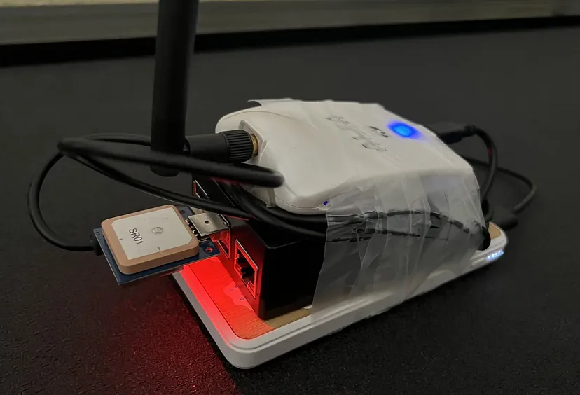
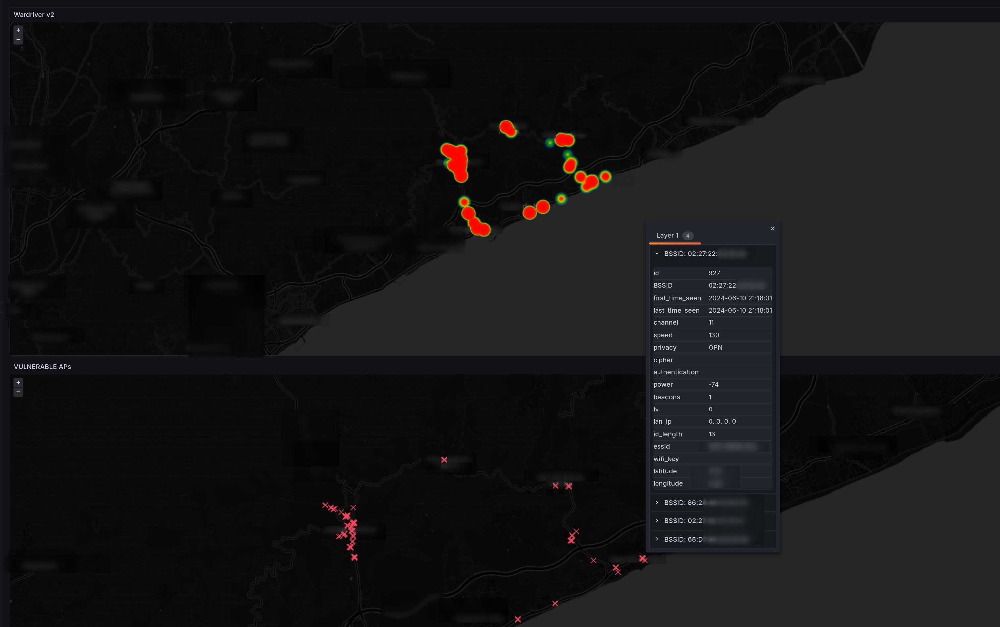

# Wardriver 

## A Wardriving framework to capture & visualize the data

This little framework is just a quick way to automate some of the most boring manual commands to type in a terminal when it comes to wireless security scanning or just wardriving for fun and learning. The aim is to automate as much as possible the information gathering sequence + the data transfer + the data ingestion and further render / representation into a dashboard in Grafana. 

To run this software you can use any Linux OS with a compatible wireless device and a compatible GPS module.
But I highly recomend do it in something small that you can carry or attach to with just some tape. In this case everything runs on a portable device (Raspberry Pi 4) powered by a battery.







## Parts breakdown

### Data collector: 
Is the wireless device + raspi + GPS that is attached to a power source and can travel autonomously. For now it just gathers data and then this data needs to be transfered to an endpoint so it ends up into a database. 

### Data parsers/ingestors: 
Some of them are inside this repo for normalizaing the data and handling some exceptions and some of them are in the "backend" side and are just executed in the data ingestion phase. Those script are made to deal with some accuracy challenges and some special casuistics. 

### Observability platform
Composed by a Grafana and a MySQL or MariaDB database server. The database just stores all the data that it needs to be rendered into the Grafana dashboard. 


## Dependencies

- Python3
- Linux OS
- gpspipe
- aircrack-ng
- airodump-ng

## Usage

    1. clone the repo
    2. cd wardriver && python3 1-wardriver.py

## Documentation: 

For now you can check this two articles: 

- **DIY Wardriving - Building your exploration arsenal PART 1:** https://medium.com/@keyboardsamurai007/diy-wardriving-building-your-wireless-exploration-arsenal-part-1-d43cbe540f1d
- **DIY Wardriving - Building your exploration arsenal PART 2:** https://medium.com/@keyboardsamurai007/diy-wardriving-building-your-wireless-exploration-arsenal-part-2-b21a89b407b1
- **DIY Wardriving - Building your exploration arsenal PART 3:** https://medium.com/@keyboardsamurai007/diy-wardriving-building-your-exploration-arsenal-part-3-fb9c2251f7cd


## Database schema
Everything is created automatically but for you to know the following fields compose the database structure:


```
arad@wifiburner> mysql -ugeoip -ppassword -h 127.0.0.1  geoip -e "desc wifi_networks;" 

+-----------------+--------------+------+-----+---------+----------------+
| Field           | Type         | Null | Key | Default | Extra          |
+-----------------+--------------+------+-----+---------+----------------+
| id              | int(11)      | NO   | PRI | NULL    | auto_increment |
| BSSID           | varchar(255) | YES  |     | NULL    |                |
| first_time_seen | datetime     | YES  |     | NULL    |                |
| last_time_seen  | datetime     | YES  |     | NULL    |                |
| channel         | int(11)      | YES  |     | NULL    |                |
| speed           | int(11)      | YES  |     | NULL    |                |
| privacy         | varchar(255) | YES  |     | NULL    |                |
| cipher          | varchar(255) | YES  |     | NULL    |                |
| authentication  | varchar(255) | YES  |     | NULL    |                |
| power           | int(11)      | YES  |     | NULL    |                |
| beacons         | int(11)      | YES  |     | NULL    |                |
| iv              | int(11)      | YES  |     | NULL    |                |
| lan_ip          | varchar(255) | YES  |     | NULL    |                |
| id_length       | int(11)      | YES  |     | NULL    |                |
| essid           | varchar(255) | YES  |     | NULL    |                |
| wifi_key        | varchar(255) | YES  |     | NULL    |                |
| latitude        | double       | YES  |     | NULL    |                |
| longitude       | double       | YES  |     | NULL    |                |
+-----------------+--------------+------+-----+---------+----------------+

```

## Compatibility

The scripts are being tested with Debian, Ubuntu, and Raspbian and it works well. No issues so far. 

## Notes

- Be sure that your wireless device is correctly specified into 1-wardriver.py it may be different that 'wlan1'.
- Take into consideration the location (indoor/outdoor) of the GPS device it may affect considerably the signal and precision. 
- Ensure your wireless device support monitoring mode.
- Ensure extremelly stable power sources. Unstable voltage make Raspberryis go crazy and it produces strange behaviours.
- You can also use the test scripts into the `tests/` folder to ensure your devices are working properly. 